# Spec Design MCP 技术方案

## 1. 文档目的

本文档用于定义 Spec Design MCP 的实现方案。该系统的首要形态不是一个人类优先的可视化设计器，而是一个可被外部 AI Agent / AI 工作流调用的 MCP 服务。服务接收多模态设计输入，经需求澄清、结构化建模、DOM AST 生成、可视化预览、问答式修订与确认，最终输出开发可消费的 HTML、工程语义标注和 JSON Schema 契约。

## 2. 方案摘要

Spec Design MCP 采用 MCP-first、单真源、双产出的实现模型：

1. 单真源：
   - `DesignDOMAST` 是设计、预览、修订、确认和导出的唯一真源。
2. 双产出：
   - 确认前产出 Review Package，用于评审、解释和修订。
   - 确认后产出 Delivery Package，用于驱动后续编码 Agent。
3. 调用方式：
   - 外部 AI Agent 通过 MCP 工具完成会话创建、输入追加、需求澄清、设计生成、设计修订、版本确认与交付导出。
4. 资源治理：
   - Review Package 相关预览资源默认是临时资源，必须具备 TTL、过期标记和回收机制。
   - Delivery Package 相关资源默认是持久资源，并通过 `artifact-manifest.json` 统一索引。

## 3. 技术定位与非目标

### 3.1 系统定位

- 形态：MCP Server
- 核心调用方：外部 AI Agent、编排工作流、IDE Agent、自动化流水线
- 核心价值：为 AI 原生研发流程提供结构化设计中间层
- 可选配套：后续可补充 Web 控制台用于人工审核，但不作为当前核心形态

### 3.2 核心技术原则

1. `DesignDOMAST` 是唯一设计真源。
2. 预览、修订、确认、导出都必须基于同一份 AST。
3. 多模态输入是硬性要求，不允许退化为纯文本产品。
4. 需求确认前必须提供可视化预览，但不提供拖拽编辑。
5. `binding.schema.json` 属于确认后的开发契约，不是确认前的评审载体。
6. Preview 相关资源默认视为临时资源，必须带有效期和回收策略。
7. Delivery Package 必须通过 `artifact-manifest.json` 作为统一入口被消费。
8. 所有模型输出必须经过 schema 校验后才能进入下一阶段。
9. 所有参考输入必须保留来源与抽象特征，禁止直接复制参考站内容。

### 3.3 非目标

- 不做拖拽式编辑器。
- 不做自由画布工具。
- 不在 MVP 阶段支持多页面站点编排。
- 不在 MVP 阶段直接输出完整 React/Vue 页面代码。
- 不在 MVP 阶段提供复杂交互动效编排器。

## 4. 双产出总体架构

### 4.1 能力概述

系统需要同时支持两类产出：

1. 确认前评审产出：
   - 让用户判断“当前设计是否合适”
   - 面向评审、解释、修订，不面向最终编码
2. 确认后开发交付：
   - 让后续编码 Agent 判断“如何继续实现”
   - 面向 HTML、标注、数据契约和组件语义

补充约束：

- Review Package 中的预览资源允许临时化存储。
- Delivery Package 中的交付资源默认持久化保存。
- 临时预览 URL 必须是短时有效链接，失效后通过显式重渲染恢复。

### 4.2 总体架构图

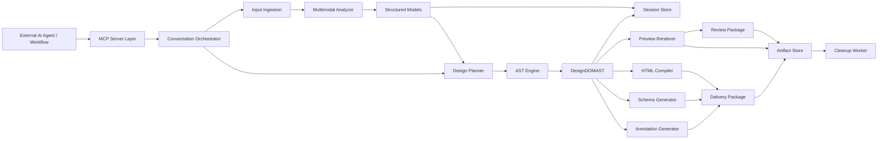

### 4.3 双产出流程图

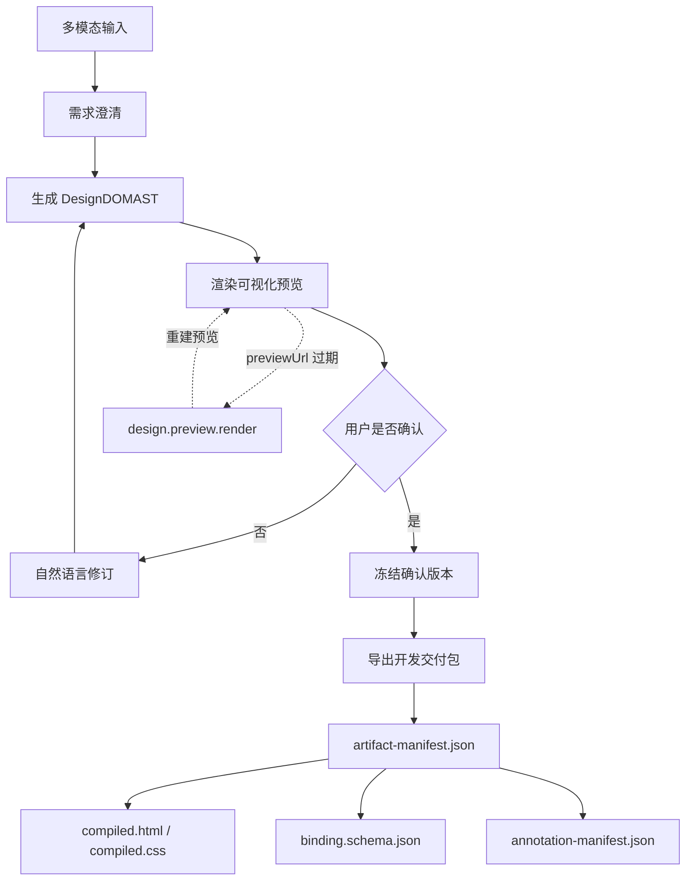

说明：

- 主链路中，确认前评审依赖可视化预览；确认后交付以 `artifact-manifest.json` 作为统一入口。
- `previewUrl` 过期不影响设计版本本身，只需要通过 `design.preview.render` 重建临时预览资源。

## 5. 生命周期与状态机

### 5.1 会话状态机

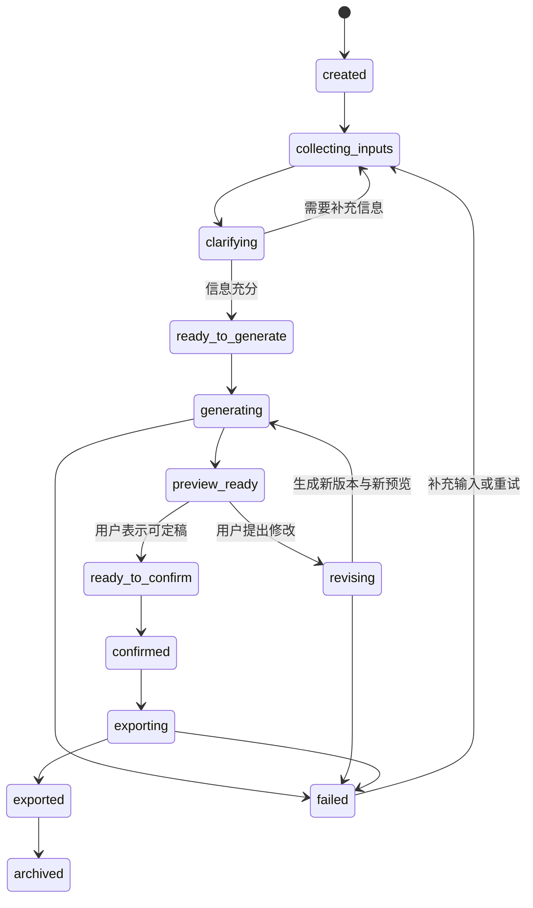

### 5.2 状态约束

- `preview_ready` 是确认前评审的主状态，意味着当前版本既有 AST，也有对应预览。
- `ready_to_confirm` 代表用户已明确表达认可，但尚未冻结版本。
- `confirmed` 之后当前版本不可直接修改；若要继续调整，必须从确认版本派生新 revision。
- `exported` 不代表会话关闭，只代表某个确认版本已经成功产出 Delivery Package。
- 任意状态若 schema 校验失败，状态不推进。
- 预览资源过期不改变 `designVersion` 的有效性，只影响当前 preview 的可访问性。

### 5.3 版本约束

- 每次生成或修订都产生新的 `designVersion`。
- 每个 `designVersion` 可以绑定零个或一个最新 `previewVersion`。
- 每个 Delivery Package 都必须显式绑定唯一 `confirmedVersion`，禁止跨版本混合导出。
- Preview Renderer 和 HTML Compiler 都只能消费经过 AST 校验的版本。
- 预览渲染失败时允许保留 AST 版本，但 `previewStatus` 必须标记为失败。

## 6. 场景与时序

### 6.1 场景 A：多模态输入 -> 澄清 -> 首版预览生成

场景目的：

- 从文本、图片、URL 中提取结构化设计意图。
- 当信息充分时生成首个可评审版本。

关键产出：

- `IntentModel`
- `ReferenceModel[]`
- `ConstraintModel`
- `DesignDOMAST@v1`
- `ReviewPackage@v1`

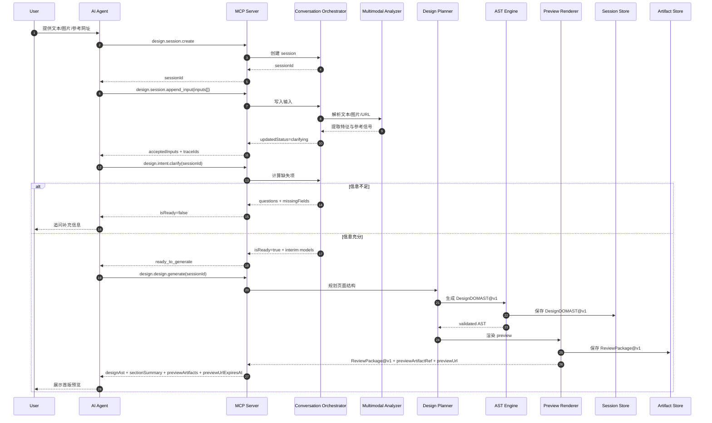

### 6.2 场景 B：确认前预览评审 -> 自然语言修订 -> 新预览

场景目的：

- 用户基于预览而不是 schema 做判断。
- 所有修改通过自然语言完成。

关键产出：

- `DesignDOMAST@vN`
- `ReviewPackage@vN`
- `diffSummary`
- `nodeDiffs[]`

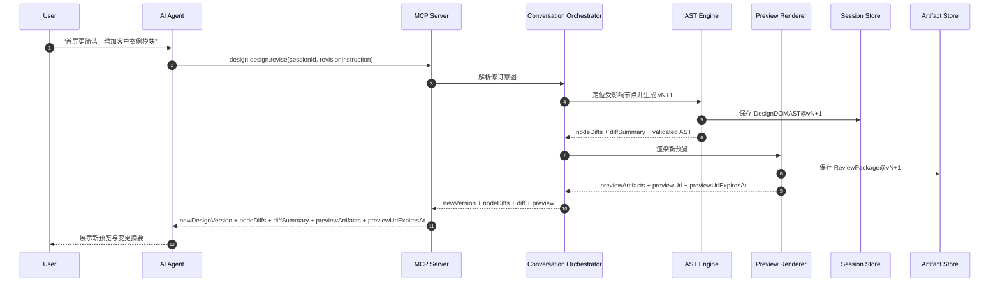

时序约束：

1. 先更新 AST，再渲染预览，禁止直接修改预览产物。
2. 每次修订必须同时生成 `nodeDiffs[]`、`diffSummary` 和新的 `previewArtifacts`。
3. 若 AST 校验通过但预览渲染失败，版本可保留为待预览状态，但会话状态不能推进到 `preview_ready`。

### 6.3 场景 C：确认版本 -> 导出开发交付包

场景目的：

- 在用户明确认可设计版本后，生成给下游编码 Agent 使用的开发契约。

关键产出：

- `DeliveryPackage@confirmedVersion`
- `artifact-manifest.json`
- `compiled.html`
- `compiled.css`
- `binding.schema.json`
- `annotation-manifest.json`

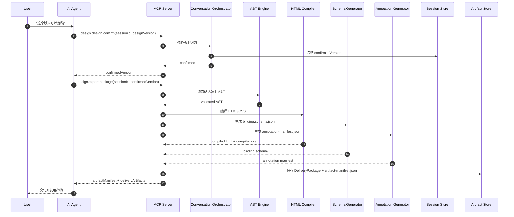

时序约束：

1. 只有 `confirmedVersion` 允许导出 Delivery Package。
2. Delivery Package 不得直接基于预览产物生成，必须直接基于确认 AST 生成。
3. `binding.schema.json`、`annotation-manifest.json`、`compiled.html` 必须属于同一个 `designVersion`。

### 6.4 场景 D：预览链接过期 -> 显式重渲染 -> 恢复评审

场景目的：

- 当临时 `previewUrl` 失效时，允许评审流程继续，而不要求重新生成设计版本。

关键产出：

- `previewArtifactRef@vN+1`
- 新的 `previewUrl`
- 新的 `previewUrlExpiresAt`

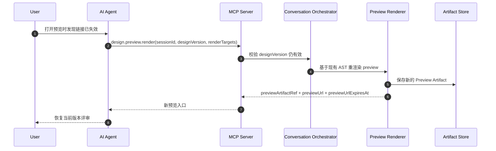

时序约束：

1. 重渲染只重建预览资源，不改变 `designVersion`。
2. 失效的是访问入口，不是设计版本本身。

### 6.5 场景 E：未确认版本尝试导出 -> 拒绝并返回可操作错误

场景目的：

- 防止调用方绕过确认直接获取开发交付包。

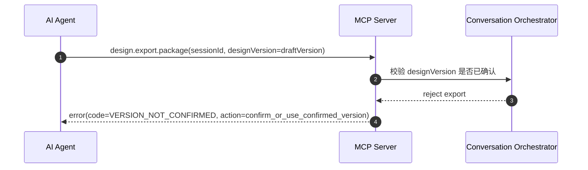

时序约束：

1. 导出失败不改变会话状态。
2. 错误响应必须包含可操作下一步，而不是仅返回失败。

### 6.6 场景 F：临时资源回收失败 -> 标记失败并进入重试

场景目的：

- 确保回收失败不影响设计版本和交付版本的有效性，同时保证系统最终一致。

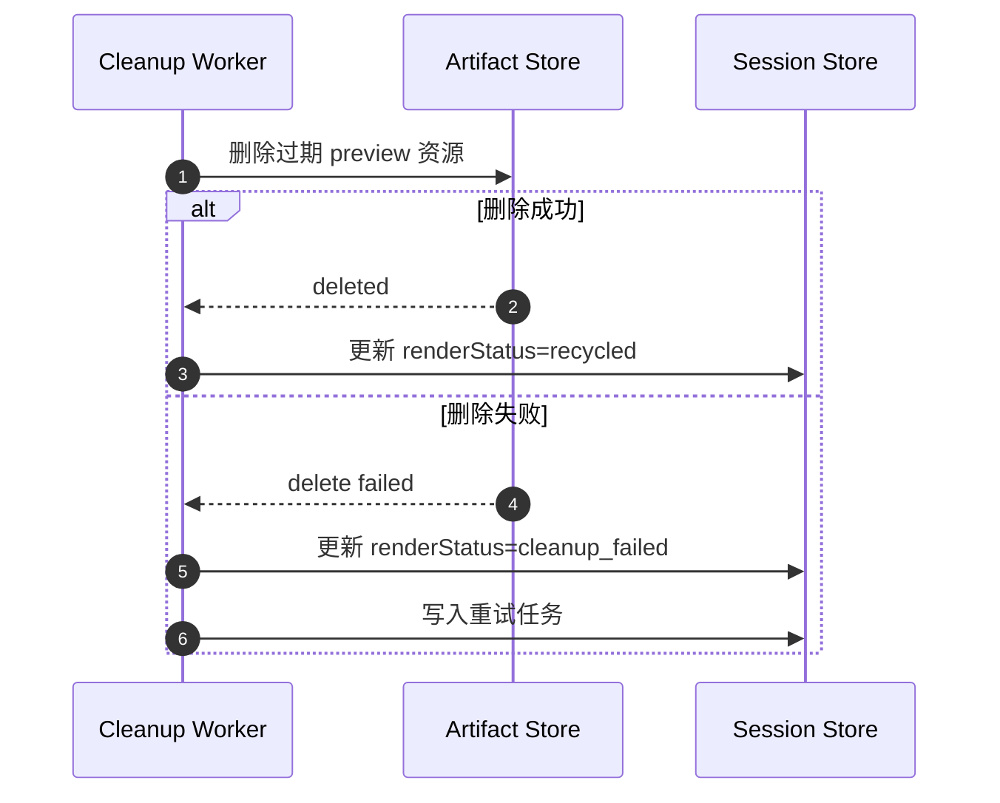

时序约束：

1. 回收失败不回滚 `confirmedVersion`。
2. 失败资源必须进入重试队列，而不是停留在未知状态。

## 7. 两类产出的定义

### 7.1 Review Package

Review Package 面向确认前评审，回答的问题是“现在的设计对不对”。

建议内容：

- `review-summary.json`
- `design-ast.json`
- `preview.html`
- `preview.png`
- `section-summary.json`
- `revision-diff.json`
- `node-diffs.json`
- `preview-metadata.json`

Review Package 的目标：

- 给 AI Agent 一个可展示、可解释、可继续修订的设计版本
- 给用户一个直观的视觉评审面
- 通过短时有效的预览资源完成确认前评审，而不长期保留无效临时文件

说明：

- `preview-metadata.json` 作为 Review Package 的索引文件，承担 review 侧 manifest 的作用。
- 该文件复用 `artifact-manifest.schema.json`，并以 `packageType=review_package` 序列化保存。

### 7.2 Delivery Package

Delivery Package 面向确认后开发，回答的问题是“后续如何实现”。

建议内容：

- `intent-model.json`
- `references.json`
- `constraints.json`
- `design-ast.json`
- `compiled.html`
- `compiled.css`
- `binding.schema.json`
- `annotation-manifest.json`
- `artifact-manifest.json`

Delivery Package 的目标：

- 给下游编码 Agent 提供稳定的开发输入
- 保留工程语义、组件候选和数据绑定信息

### 7.3 两类产出的边界

| 项目 | Review Package | Delivery Package |
| --- | --- | --- |
| 使用阶段 | 确认前 | 确认后 |
| 主要消费者 | 用户、评审 Agent | 编码 Agent |
| 核心问题 | 设计是否合适 | 如何继续实现 |
| 主要内容 | preview、summary、diff | html、css、schema、annotation |
| 是否要求确认 | 否 | 是 |

## 8. MCP 工具设计

### 8.1 工具设计原则

1. 主链路工具要少而稳定，避免把简单流程拆成过多微工具。
2. 预览能力是主链路能力，因此默认集成在生成与修订响应中。
3. 单独保留 `design.preview.render` 用于显式重渲染、缓存失效恢复和外部再取图场景。
4. 所有导出类工具默认返回 manifest 或 artifact ref，而不是要求调用方自行拼文件路径。

### 8.2 `design.session.create`

用途：

- 创建新设计会话

输入：

- `projectName`
- `goal`
- `preferredOutputs`

输出：

- `sessionId`
- `status`
- `createdAt`

### 8.3 `design.session.append_input`

用途：

- 向现有会话追加文本、图片、网址或约束输入

输入：

- `sessionId`
- `inputs[]`

输出：

- `acceptedInputs[]`
- `traceIds[]`
- `updatedStatus`

### 8.4 `design.intent.clarify`

用途：

- 判断当前信息是否足够
- 返回缺失项和澄清问题

输入：

- `sessionId`

输出：

- `isReady`
- `missingFields[]`
- `questions[]`
- `interimIntentModel`
- `interimConstraintModel`

### 8.5 `design.design.generate`

用途：

- 在信息充分时生成首版设计和首版预览

输入：

- `sessionId`
- `generationMode`

输出：

- `designVersion`
- `designAst`
- `sectionSummary[]`
- `previewArtifacts`
- `previewArtifactRef`
- `previewUrl`
- `previewUrlExpiresAt`
- `reviewPackageRef`
- `openIssues[]`

### 8.6 `design.design.revise`

用途：

- 基于自然语言修订当前设计版本，并返回新预览

输入：

- `sessionId`
- `revisionInstruction`

输出：

- `newDesignVersion`
- `nodeDiffs[]`
- `designAst`
- `diffSummary[]`
- `previewArtifacts`
- `previewArtifactRef`
- `previewUrl`
- `previewUrlExpiresAt`
- `reviewPackageRef`
- `followupQuestions[]`

### 8.7 `design.preview.render`

用途：

- 对指定版本显式重渲染预览
- 用于缓存失效恢复、额外截图、重新生成预览地址

输入：

- `sessionId`
- `designVersion`
- `renderTargets`

输出：

- `previewVersion`
- `previewArtifacts`
- `previewArtifactRef`
- `previewUrl`
- `previewUrlExpiresAt`
- `reviewPackageRef`

### 8.8 `design.design.confirm`

用途：

- 确认当前设计版本并冻结导出基线

输入：

- `sessionId`
- `designVersion`

输出：

- `status`
- `confirmedVersion`
- `confirmedAt`

### 8.9 `design.export.package`

用途：

- 导出确认版本对应的开发交付包
- 不传 `designVersion` 时默认导出 `confirmedVersion`
- 传入 `designVersion` 时只能是已确认版本

输入：

- `sessionId`
- `designVersion?`
- `exportTargets`

输出：

- `artifactManifest`
- `html`
- `css`
- `bindingSchema`
- `annotationManifest`
- `deliveryPackageRef`

## 9. 核心数据模型

### 9.1 Session

```json
{
  "$id": "spec-design/session.schema.json",
  "type": "object",
  "required": [
    "sessionId",
    "status",
    "inputs",
    "versions",
    "createdAt"
  ],
  "properties": {
    "sessionId": { "type": "string" },
    "status": {
      "type": "string",
      "enum": [
        "created",
        "collecting_inputs",
        "clarifying",
        "ready_to_generate",
        "generating",
        "preview_ready",
        "revising",
        "ready_to_confirm",
        "confirmed",
        "exporting",
        "exported",
        "archived",
        "failed"
      ]
    },
    "inputs": {
      "type": "array",
      "items": { "$ref": "spec-design/input-item.schema.json" }
    },
    "intentModel": { "$ref": "spec-design/intent-model.schema.json" },
    "references": {
      "type": "array",
      "items": { "$ref": "spec-design/reference-model.schema.json" }
    },
    "constraints": { "$ref": "spec-design/constraint-model.schema.json" },
    "versions": {
      "type": "array",
      "items": { "$ref": "spec-design/design-version.schema.json" }
    },
    "confirmedVersion": { "type": "string" },
    "createdAt": { "type": "string", "format": "date-time" },
    "updatedAt": { "type": "string", "format": "date-time" }
  },
  "additionalProperties": false
}
```

### 9.2 Design Version

```json
{
  "$id": "spec-design/design-version.schema.json",
  "type": "object",
  "required": ["designVersion", "astRef", "createdAt"],
  "properties": {
    "designVersion": { "type": "string" },
    "parentVersion": { "type": "string" },
    "astRef": { "type": "string" },
    "previewRef": { "type": "string" },
    "nodeDiffRef": { "type": "string" },
    "previewStatus": {
      "type": "string",
      "enum": ["not_rendered", "ready", "failed", "expired", "recycled", "cleanup_failed"]
    },
    "previewExpiresAt": { "type": "string", "format": "date-time" },
    "status": {
      "type": "string",
      "enum": ["draft", "preview_ready", "confirmed", "exported", "failed"]
    },
    "diffFromParent": {
      "type": "array",
      "items": { "type": "string" }
    },
    "createdAt": { "type": "string", "format": "date-time" }
  },
  "additionalProperties": false
}
```

### 9.3 Intent Model

```json
{
  "$id": "spec-design/intent-model.schema.json",
  "type": "object",
  "required": ["pageType", "businessGoal", "targetUsers", "stylePreference"],
  "properties": {
    "pageType": {
      "type": "string",
      "enum": ["landing_page", "dashboard", "form_page", "marketing_page", "custom"]
    },
    "businessGoal": { "type": "string" },
    "targetUsers": {
      "type": "array",
      "items": { "type": "string" },
      "minItems": 1
    },
    "stylePreference": { "type": "string" },
    "tone": { "type": "string" },
    "interactionPreference": { "type": "string" },
    "responsiveRequirement": { "type": "boolean" },
    "locale": { "type": "string" },
    "deliverables": {
      "type": "array",
      "items": {
        "type": "string",
        "enum": [
          "review_package",
          "delivery_package",
          "html",
          "css",
          "binding_schema",
          "annotation_manifest",
          "design_ast"
        ]
      }
    }
  },
  "additionalProperties": false
}
```

### 9.4 Reference Model

```json
{
  "$id": "spec-design/reference-model.schema.json",
  "type": "object",
  "required": ["referenceId", "type", "source", "parsedFeatures"],
  "properties": {
    "referenceId": { "type": "string" },
    "type": {
      "type": "string",
      "enum": ["text", "image", "url"]
    },
    "source": { "type": "string" },
    "title": { "type": "string" },
    "parsedFeatures": {
      "type": "array",
      "items": { "type": "string" }
    },
    "usableElements": {
      "type": "array",
      "items": { "type": "string" }
    },
    "styleSignals": {
      "type": "array",
      "items": { "type": "string" }
    },
    "trace": {
      "type": "object",
      "properties": {
        "capturedAt": { "type": "string", "format": "date-time" },
        "storageKey": { "type": "string" }
      },
      "additionalProperties": false
    }
  },
  "additionalProperties": false
}
```

### 9.5 Constraint Model

```json
{
  "$id": "spec-design/constraint-model.schema.json",
  "type": "object",
  "properties": {
    "mustHave": {
      "type": "array",
      "items": { "type": "string" }
    },
    "mustNotHave": {
      "type": "array",
      "items": { "type": "string" }
    },
    "brandRules": {
      "type": "array",
      "items": { "type": "string" }
    },
    "responsiveRules": {
      "type": "array",
      "items": { "type": "string" }
    },
    "contentRules": {
      "type": "array",
      "items": { "type": "string" }
    },
    "engineeringRules": {
      "type": "array",
      "items": { "type": "string" }
    }
  },
  "additionalProperties": false
}
```

### 9.6 Input Item

```json
{
  "$id": "spec-design/input-item.schema.json",
  "type": "object",
  "required": ["inputId", "type", "payload"],
  "properties": {
    "inputId": { "type": "string" },
    "type": {
      "type": "string",
      "enum": ["text", "image", "url", "brand_rule", "content_seed"]
    },
    "payload": { "type": "string" },
    "metadata": {
      "type": "object",
      "properties": {
        "mimeType": { "type": "string" },
        "filename": { "type": "string" },
        "sourceUrl": { "type": "string" }
      },
      "additionalProperties": false
    }
  },
  "additionalProperties": false
}
```

### 9.7 Design DOM AST

```json
{
  "$id": "spec-design/design-node.schema.json",
  "type": "object",
  "required": ["id", "tag", "children", "meta"],
  "properties": {
    "id": { "type": "string" },
    "tag": { "type": "string" },
    "name": { "type": "string" },
    "text": { "type": "string" },
    "attrs": {
      "type": "object",
      "additionalProperties": { "type": "string" }
    },
    "style": {
      "type": "object",
      "additionalProperties": {
        "anyOf": [{ "type": "string" }, { "type": "number" }, { "type": "boolean" }]
      }
    },
    "layout": {
      "type": "object",
      "properties": {
        "mode": {
          "type": "string",
          "enum": ["block", "flex", "grid", "absolute"]
        },
        "direction": {
          "type": "string",
          "enum": ["row", "column"]
        },
        "gap": { "type": "number" },
        "align": { "type": "string" },
        "justify": { "type": "string" },
        "columns": { "type": "number" }
      },
      "additionalProperties": false
    },
    "children": {
      "type": "array",
      "items": { "$ref": "spec-design/design-node.schema.json" }
    },
    "meta": {
      "type": "object",
      "required": ["nodeType"],
      "properties": {
        "nodeType": {
          "type": "string",
          "enum": [
            "section",
            "container",
            "text",
            "image",
            "button",
            "list",
            "form",
            "data_view",
            "decoration"
          ]
        },
        "componentCandidate": { "type": "boolean" },
        "componentName": { "type": "string" },
        "dataBinding": { "type": "string" },
        "repeatable": { "type": "boolean" },
        "editableText": { "type": "boolean" },
        "assetType": {
          "type": "string",
          "enum": ["image", "icon", "lottie", "svg", "video", "none"]
        },
        "animationType": { "type": "string" },
        "contentRole": {
          "type": "string",
          "enum": ["static", "dynamic", "mixed"]
        }
      },
      "additionalProperties": false
    }
  },
  "additionalProperties": false
}
```

根节点约束：

```json
{
  "$id": "spec-design/design-ast.schema.json",
  "type": "object",
  "required": ["version", "root"],
  "properties": {
    "version": { "type": "string" },
    "root": { "$ref": "spec-design/design-node.schema.json" }
  },
  "additionalProperties": false
}
```

### 9.8 Preview Artifact

```json
{
  "$id": "spec-design/preview-artifact.schema.json",
  "type": "object",
  "required": ["previewArtifactRef", "previewVersion", "designVersion", "renderStatus", "artifacts"],
  "properties": {
    "previewArtifactRef": { "type": "string" },
    "reviewPackageRef": { "type": "string" },
    "previewVersion": { "type": "string" },
    "designVersion": { "type": "string" },
    "renderStatus": {
      "type": "string",
      "enum": ["ready", "failed", "expired", "recycled", "cleanup_failed"]
    },
    "previewUrl": { "type": "string" },
    "previewUrlExpiresAt": { "type": "string", "format": "date-time" },
    "expiresAt": { "type": "string", "format": "date-time" },
    "cleanupAfter": { "type": "string", "format": "date-time" },
    "storageClass": {
      "type": "string",
      "enum": ["temporary", "persistent"]
    },
    "artifacts": {
      "type": "object",
      "properties": {
        "previewHtmlRef": { "type": "string" },
        "previewImageRef": { "type": "string" },
        "previewUrl": { "type": "string" },
        "sectionSummaryRef": { "type": "string" },
        "reviewSummaryRef": { "type": "string" },
        "revisionDiffRef": { "type": "string" },
        "nodeDiffsRef": { "type": "string" },
        "previewMetadataRef": { "type": "string" }
      },
      "additionalProperties": false
    }
  },
  "additionalProperties": false
}
```

### 9.9 Node Diff

```json
{
  "$id": "spec-design/node-diff.schema.json",
  "type": "object",
  "required": ["nodeId", "operation", "fieldPath"],
  "properties": {
    "nodeId": { "type": "string" },
    "operation": {
      "type": "string",
      "enum": ["add", "update", "remove", "move"]
    },
    "fieldPath": { "type": "string" },
    "before": {},
    "after": {},
    "reason": { "type": "string" },
    "affectedPreviewRegion": { "type": "string" }
  },
  "additionalProperties": false
}
```

### 9.10 Binding Schema

```json
{
  "$id": "spec-design/binding.schema.json",
  "type": "object",
  "required": ["entities"],
  "properties": {
    "entities": {
      "type": "array",
      "items": {
        "type": "object",
        "required": ["name", "fields"],
        "properties": {
          "name": { "type": "string" },
          "fields": {
            "type": "array",
            "items": {
              "type": "object",
              "required": ["key", "type"],
              "properties": {
                "key": { "type": "string" },
                "type": {
                  "type": "string",
                  "enum": [
                    "string",
                    "number",
                    "boolean",
                    "image",
                    "url",
                    "richtext",
                    "array",
                    "object"
                  ]
                },
                "required": { "type": "boolean" },
                "example": {}
              },
              "additionalProperties": false
            }
          }
        },
        "additionalProperties": false
      }
    }
  },
  "additionalProperties": false
}
```

### 9.11 Annotation Manifest

```json
{
  "$id": "spec-design/annotation-manifest.schema.json",
  "type": "object",
  "required": ["nodes"],
  "properties": {
    "nodes": {
      "type": "array",
      "items": {
        "type": "object",
        "required": ["nodeId", "annotations"],
        "properties": {
          "nodeId": { "type": "string" },
          "annotations": {
            "type": "object",
            "properties": {
              "componentCandidate": { "type": "boolean" },
              "componentName": { "type": "string" },
              "dataBinding": { "type": "string" },
              "repeatSource": { "type": "string" },
              "assetKey": { "type": "string" },
              "animationKey": { "type": "string" }
            },
            "additionalProperties": false
          }
        },
        "additionalProperties": false
      }
    }
  },
  "additionalProperties": false
}
```

### 9.12 Artifact Manifest

```json
{
  "$id": "spec-design/artifact-manifest.schema.json",
  "type": "object",
  "required": [
    "packageType",
    "sessionId",
    "designVersion",
    "generatedAt",
    "artifacts"
  ],
  "properties": {
    "packageType": {
      "type": "string",
      "enum": ["review_package", "delivery_package"]
    },
    "sessionId": { "type": "string" },
    "designVersion": { "type": "string" },
    "confirmedAt": { "type": "string", "format": "date-time" },
    "generatedAt": { "type": "string", "format": "date-time" },
    "generatorVersion": { "type": "string" },
    "artifacts": {
      "type": "array",
      "items": {
        "type": "object",
        "required": ["name", "ref", "kind"],
        "properties": {
          "name": { "type": "string" },
          "ref": { "type": "string" },
          "kind": { "type": "string" },
          "temporary": { "type": "boolean" },
          "expiresAt": { "type": "string", "format": "date-time" }
        },
        "additionalProperties": false
      }
    }
  },
  "additionalProperties": false
}
```

说明：

- Delivery Package 的索引文件命名为 `artifact-manifest.json`。
- Review Package 的索引文件命名为 `preview-metadata.json`，但其结构同样遵循该 schema，并使用 `packageType=review_package`。

## 10. 预览渲染与开发交付层

### 10.1 预览渲染链路

Preview Renderer 的职责是把 AST 渲染为“便于评审”的产物，而不是“便于编码”的产物。

产出：

- `preview.html`
- `preview.png`
- `previewUrl`
- `sectionSummary`
- `preview-metadata.json`
- `previewArtifactRef`

预览访问原则：

- MCP 响应以 `previewArtifactRef + previewUrl` 作为主要入口。
- `previewUrl` 必须是短时有效链接。
- URL 失效后，不自动延长，必须通过 `design.preview.render` 重建。

### 10.2 开发交付链路

开发交付层负责把确认后的 AST 和已验证的结构化模型整理为“便于编码”的产物。

其中：

- HTML Compiler 负责生成 `compiled.html` 与 `compiled.css`
- Schema Generator 负责生成 `binding.schema.json`
- Annotation Generator 负责生成 `annotation-manifest.json`
- 导出编排逻辑负责把 `intent-model.json`、`references.json`、`constraints.json`、`design-ast.json` 与上述生成结果统一写入 Delivery Package，并生成 `artifact-manifest.json`

产出：

- `compiled.html`
- `compiled.css`
- `binding.schema.json`
- `annotation-manifest.json`
- `intent-model.json`
- `references.json`
- `constraints.json`
- `design-ast.json`
- `artifact-manifest.json`

下游消费原则：

1. 下游编码 Agent 必须先读取 `artifact-manifest.json`。
2. manifest 再索引 HTML、CSS、Schema、Annotation 等具体文件。
3. 不建议下游 Agent 直接猜测文件名或存储路径。

### 10.3 AST 到两类产出的映射图

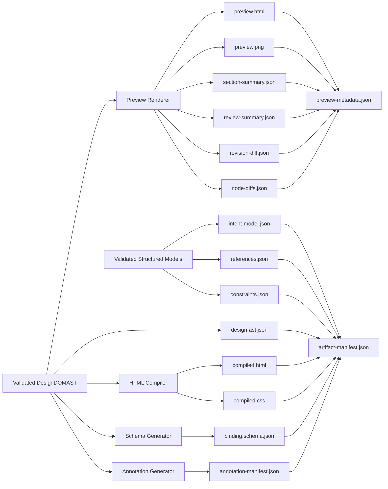

### 10.4 `data-ai-*` 标注规范

组件候选：

```html
<section
  data-ai-component-candidate="true"
  data-ai-component-name="HeroBanner"
></section>
```

数据绑定：

```html
<span data-ai-bind="hero.title">Build with AI</span>
```

循环数据：

```html
<li data-ai-repeat="features" data-ai-item="feature"></li>
```

资源标记：

```html

```

动效标记：

```html
<div data-ai-animation="lottie" data-ai-animation-id="heroMotion"></div>
```

可编辑文本：

```html
<h1 data-ai-editable="text">Structured design for coding agents</h1>
```

## 11. 模块设计

### 11.1 模块关系图

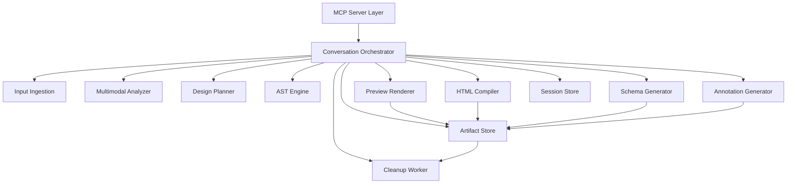

### 11.2 模块职责

`MCP Server Layer`

- 暴露工具
- 统一输入输出协议
- 管理工具级错误码

`Conversation Orchestrator`

- 控制会话状态流转
- 判断是否需要追问
- 编排生成、预览、修订、确认与导出

`Input Ingestion`

- 接收文本、图片、URL 输入
- 归档原始来源
- 生成输入 trace

`Multimodal Analyzer`

- 文本语义解析
- 图片理解
- URL 内容提取
- 风格与布局特征抽象

`Design Planner`

- 页面分区规划
- 信息架构生成
- 组件候选识别

`AST Engine`

- AST CRUD
- 修订意图定位
- 版本 diff
- 合法性校验

`Preview Renderer`

- 根据 AST 渲染可评审预览
- 生成截图、预览地址和区块摘要
- 生成临时资源 TTL 元数据
- 与 Artifact Store 协作登记可回收资源

`HTML Compiler`

- 把确认版 AST 编译成 HTML/CSS

`Schema Generator`

- 生成数据绑定契约

`Annotation Generator`

- 生成工程语义清单

`Cleanup Worker`

- 扫描过期临时资源
- 执行软删除后的物理回收
- 处理孤儿资源与回收失败重试

`Session Store`

- 保存会话状态、结构化模型、版本元数据和 ref

`Artifact Store`

- 保存预览产物、交付产物和 manifest
- 区分临时资源与持久资源
- 配合 Cleanup Worker 执行资源过期标记、延迟清理和孤儿文件回收

## 12. 存储与产物生命周期

### 12.1 推荐存储

- 运行时：Node.js + TypeScript
- MCP 协议层：官方 MCP SDK
- 主存储：PostgreSQL
- 资源存储：本地文件系统或 S3 兼容对象存储
- 校验层：Zod + JSON Schema

资源分层建议：

- 持久资源：确认版 AST、Delivery Package、manifest
- 临时资源：preview.html、preview.png、signed previewUrl、临时截图缓存

### 12.2 生命周期图

```mermaid
flowchart TD
    A[Raw Inputs] --> B[Structured Models]
    B --> C[Session Store]
    B --> D[DesignDOMAST Versions]
    D --> C
    D --> E[Preview Artifacts (Temporary)]
    D --> F[Confirmed Version]
    F --> C
    F --> G[Delivery Artifacts (Persistent)]
    E --> H[Review Package]
    G --> I[Delivery Package]
```

### 12.3 临时资源生命周期与回收

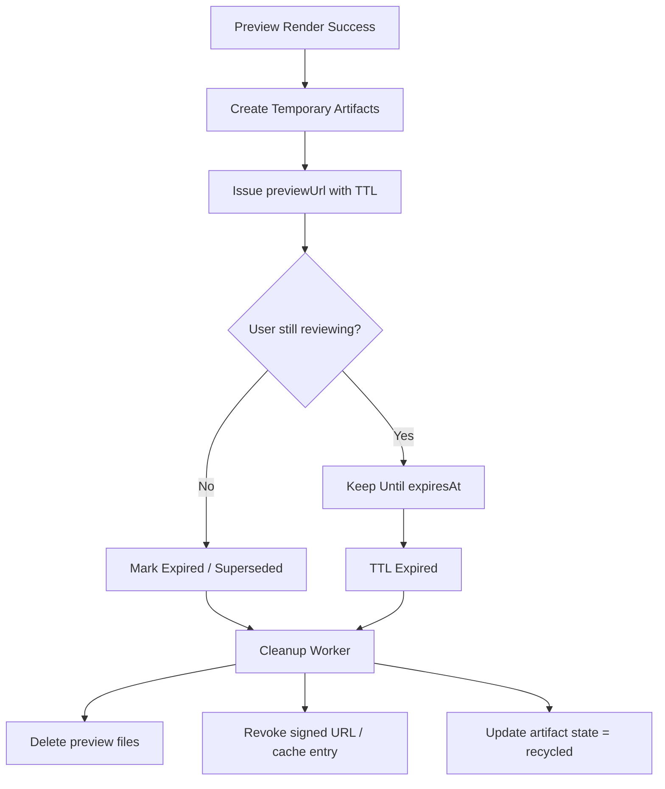

回收规则：

1. `previewUrl` 必须带 `previewUrlExpiresAt`。
2. `preview.html`、`preview.png` 等确认前产物默认使用临时存储策略。
3. 当出现以下情况时，预览资源进入可回收状态：
   - 预览 URL 过期
   - 新的 `previewVersion` 已替代旧版本
   - 会话被归档
   - 用户已确认并完成导出，且旧预览不再保留
4. Cleanup Worker 必须幂等，允许重复执行。
5. 清理失败时只重试回收任务，不影响 `designVersion` 和 `confirmedVersion` 的有效性。

推荐 TTL 策略：

- `previewUrl`：15 分钟到 1 小时
- `preview.html` / `preview.png`：24 小时到 72 小时
- `preview-metadata.json`：可与预览资源同 TTL，或略长于预览资源

清理机制：

- 软删除：先把资源状态更新为 `expired`
- 延迟删除：由 Cleanup Worker 执行物理删除
- 孤儿回收：定期扫描“数据库无引用但对象存储仍存在”的残留资源
- 失败重试：指数退避，超过阈值后进入 dead-letter cleanup queue

### 12.4 建议数据表

- `sessions`
- `session_inputs`
- `references`
- `constraints`
- `design_versions`
- `preview_artifacts`
- `delivery_artifacts`
- `export_jobs`
- `artifact_cleanup_jobs`
- `artifact_access_tokens`

## 13. 错误处理与恢复

必须覆盖以下失败类型：

- 输入不可解析
- 图片或 URL 抓取失败
- LLM 输出不符合 schema
- AST 修订后结构非法
- 预览渲染失败
- 临时资源签名 URL 失效
- 资源回收失败
- HTML 编译失败
- Schema 生成失败
- 导出包缺失关键产物

恢复策略：

1. 输入失败时返回可操作错误原因和建议补充动作。
2. schema 失败时先自动修复一次，不成功则返回失败详情。
3. AST 非法时拒绝写入版本库。
4. 预览失败时保留 AST，但状态不得推进为 `preview_ready`。
5. 导出失败时保留确认版本，不回滚已确认状态。
6. 预览 URL 失效时通过 `design.preview.render` 重新生成，不直接复活旧 URL。
7. 回收任务失败时进入重试队列，并标记资源为 `cleanup_failed` 以供后续巡检。

## 14. 可观测性要求

必须记录：

- `sessionId`
- 工具调用链
- 输入类型分布
- 追问次数
- 设计版本数
- 预览生成成功率
- 预览 URL 签发次数
- 临时资源回收成功率
- 孤儿资源数量
- schema 校验失败原因
- 导出成功率

关键指标：

- `clarification_completion_rate`
- `preview_render_success_rate`
- `temporary_artifact_cleanup_success_rate`
- `orphan_artifact_count`
- `schema_validation_pass_rate`
- `design_revision_success_rate`
- `export_success_rate`
- `mean_questions_per_session`

## 15. 安全与边界

### 15.1 内容边界

- 参考图和参考站仅用于特征提取，不直接复制结构和文案。
- 外部 URL 抓取必须留痕。
- 输出中需标识哪些内容来自用户输入，哪些由系统生成。
- 预览 URL 不得使用永久公开链接，必须使用短时授权访问。

### 15.2 服务边界

- MCP 工具必须是幂等或显式版本化。
- Preview Package 和 Delivery Package 都必须带版本号。
- 禁止无确认直接导出开发交付物。
- 禁止绕过 AST 直接修改预览或导出产物。
- 禁止把临时 preview 资源作为长期对外依赖。
- Cleanup Worker 不得删除仍被当前 `previewArtifactRef` 或 `artifact-manifest.json` 引用的有效资源。

## 16. MVP 范围

### 16.1 支持的页面类型

- Landing Page
- Dashboard
- Form Page

### 16.2 支持的输入

- 文本
- 图片
- 网址

### 16.3 支持的能力

- 会话创建
- 多模态输入接入
- 需求澄清
- DOM AST 初稿生成
- 确认前预览渲染
- 临时预览资源 TTL 与回收
- 问答式修订
- 设计确认
- HTML/CSS 导出
- `data-ai-*` 标注导出
- `annotation-manifest.json` 导出
- `binding.schema.json` 导出
- `artifact-manifest.json` 导出

### 16.4 暂不实现

- 拖拽式编辑器
- 自由画布
- 多页面站点编排
- 复杂动效编排器
- 直接 React/Vue 代码生成
- 团队协作审批流

## 17. 实施顺序

### 17.1 路线图

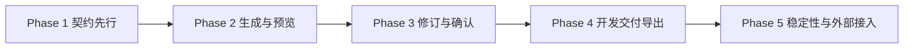

### 17.2 各阶段内容

`Phase 1：契约先行`

- 定义全部 JSON Schema
- 定义 MCP 工具输入输出
- 定义会话状态机

`Phase 2：生成与预览`

- 接入多模态分析
- 实现结构化意图建模
- 生成初版 AST
- 生成首版 Review Package
- 接入短时预览 URL 和临时资源登记

`Phase 3：修订与确认`

- 实现自然语言修订 AST
- 增加版本 diff
- 增加确认前评审闭环

`Phase 4：开发交付导出`

- HTML/CSS 编译
- `data-ai-*` 标注注入与 `annotation-manifest.json` 生成
- `binding.schema.json` 生成
- Delivery Package 归档
- `artifact-manifest.json` 生成

`Phase 5：稳定性与外部接入`

- 可观测性
- 错误恢复
- MCP 外部接入样例
- Cleanup Worker 与孤儿资源回收

## 18. 建议目录结构

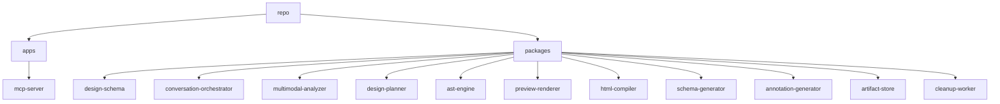
